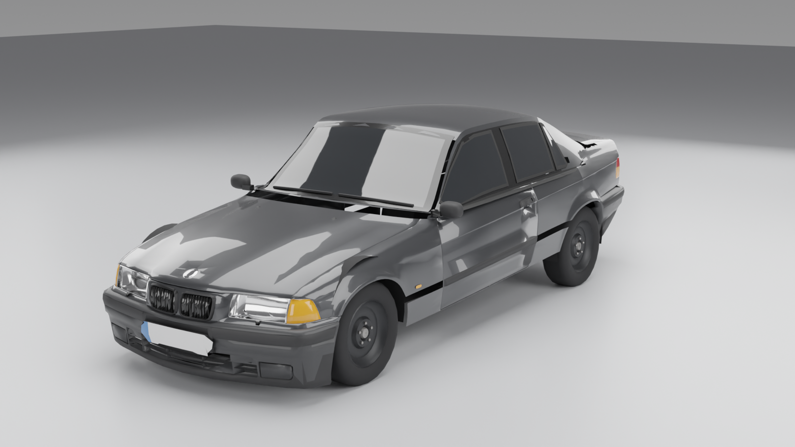
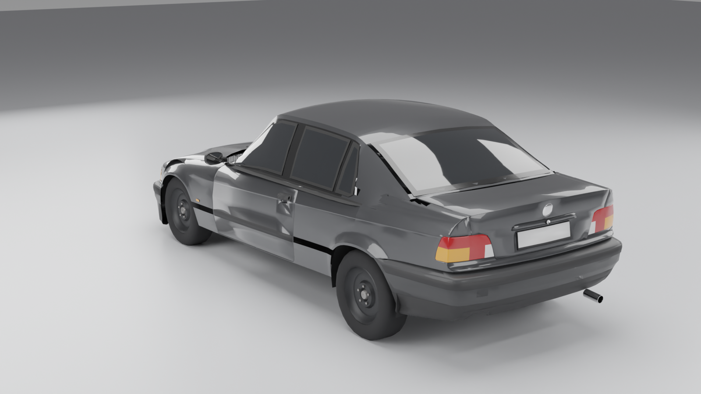
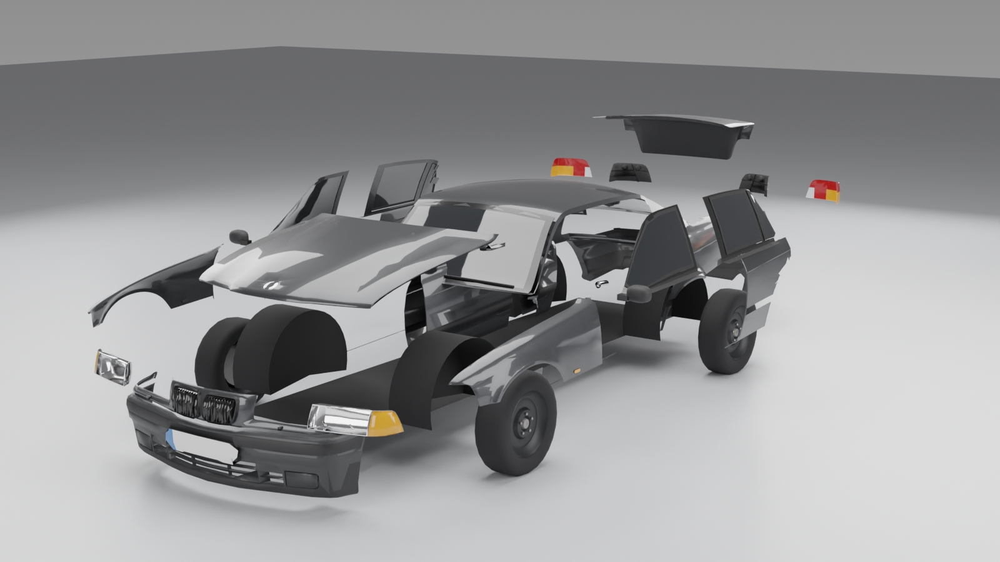

# BMW E36 sedan (pre-facelift, non-M) — low-poly game model

Model do gry, ok. **26 tys. trójkątów** (LOD0) / ~12 tys. (LOD1), bez wnętrza, podzielony
na wymienne części. Szyby są nieprzezroczyste (ciemne, z połyskiem), materiały to czyste
PBR (Principled BSDF), więc glTF przenosi je 1:1.





## Pliki (`out/`)

| plik | opis |
|---|---|
| `e36_sedan.glb` | całe auto z hierarchią części (LOD0) |
| `e36_sedan_LOD1.glb` | to samo, ~45% trójkątów |
| `e36_sedan.blend` | scena źródłowa Blender |
| `parts/<część>.glb` | każda część osobno, origin = jej socket |
| `sockets.json` | socket → rodzic, pozycja (glTF, Y-up, +Z = przód), liczba trójkątów, plik |

Układ: metry, przód auta = +Z w glTF (−Y w Blenderze), środek między osiami na ziemi = (0,0,0).

## Części / sockety

- **body** – skorupa, dach/słupki sedana, nadkola, podłoga
- **hood** (zawias z tyłu), **trunk_lid** (zawias z przodu)
- **door_FL / FR / RL / RR** – origin na osi zawiasu; drzwi mają jako dzieci szyby
  (`glass_door_*`, `glass_quarter_R*`) i lusterka (`mirror_L/R` na przednich)
- **fender_L / R** (+ `side_repeater_L/R`), **bumper_F** (+ `plate_F`), **bumper_R**
- **headlight_L / R**, **grille_kidney**, **front_panel**, **taillight_L / R**, **rear_panel**
- **glass_windshield**, **glass_rear**, **wipers**, **exhaust**
- **WHEEL_FL/FR/RL/RR** – puste huby (socket koła) z dziećmi `rim_*`, `tyre_*`, `brake_*`,
  `caliper_*`; felga stalowa 15" i opona 185/65 R15 współdzielą meshe (`parts/wheel_*.glb`)

Podmiana części: wczytaj inny GLB i podepnij pod ten sam socket (pozycja z `sockets.json`,
geometria części jest w lokalnych współrzędnych socketu).

## Jak to jest zbudowane

1. `tools/extract_mod.py` wczytuje `comet.dff` z moda *BMW 325i E36 (GTA:SA, konwersja
   bmwmanqk, gtaall.com)* przez czytnik DFF z [DragonFF](https://github.com/Parik27/DragonFF),
   skaluje go do wymiarów fabrycznych (rozstaw osi 2700 mm) i zostawia tylko seryjne blachy
   (bez silnika, turbo, progów, wnętrza, spojlera, naklejek).
2. `build.py` (`lib/modbase.py`): mapuje materiały moda na PBR, tnie coupe na części sedana
   płaszczyznami (słupek B, tylne drzwi, próg, linia okien), usuwa kabinę coupe, decymuje do
   budżetu i przenosi normalne z pełnej siatki (gładkie cieniowanie low-poly).
3. Kabina sedana (dach, słupki A/B/C z „Hofmeister kink”, ramy drzwi, szyby), koła,
   lusterka, wycieraczki, wydech i nadkola są generowane proceduralnie (`lib/body.py`,
   `lib/glass.py`, `lib/wheels.py`, `lib/details.py`).
4. `export.py` → GLB, części, `sockets.json`, LOD1. `render.py` → rendery kontrolne (Cycles).

```
pip install bpy                     # Blender 5.0 jako moduł Pythona
python3 tools/extract_mod.py <katalog_z_DragonFF> comet.dff mod_ext.blend
python3 build.py out --mod mod_ext.blend
python3 export.py out/e36_sedan.blend out
python3 render.py out/e36_sedan.glb docs/renders 96 1600 front34 rear34 side exploded
```

**Licencja:** blachy poniżej linii okien pochodzą z moda z gtaall.com. Do projektu
prywatnego to OK; przed użyciem komercyjnym trzeba sprawdzić prawa autora konwersji
(i znaki towarowe BMW).

## Znane ograniczenia

- UV to prosta projekcja pudełkowa (starcza dla materiałów bez tekstur; pod malowanie
  tekstur trzeba zrobić unwrap).
- Szczeliny paneli nie są wycięte w geometrii (części stykają się krawędziami).
- Reflektory pochodzą z moda i wyglądają bardziej na liftowe (gładki klosz) niż na
  przedliftowe.
